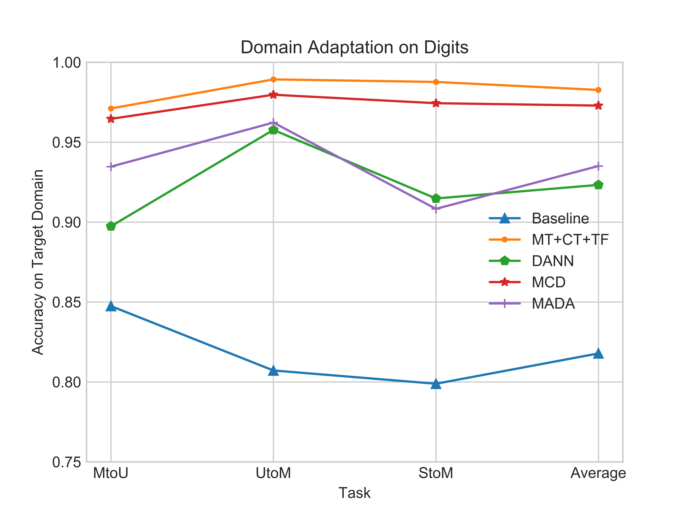
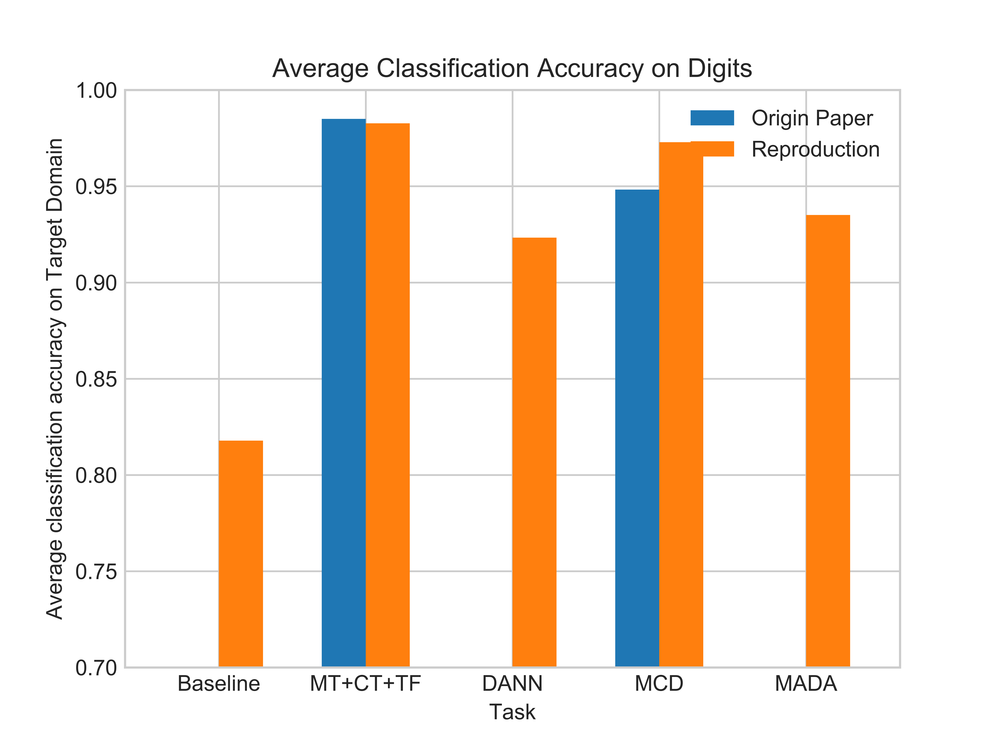
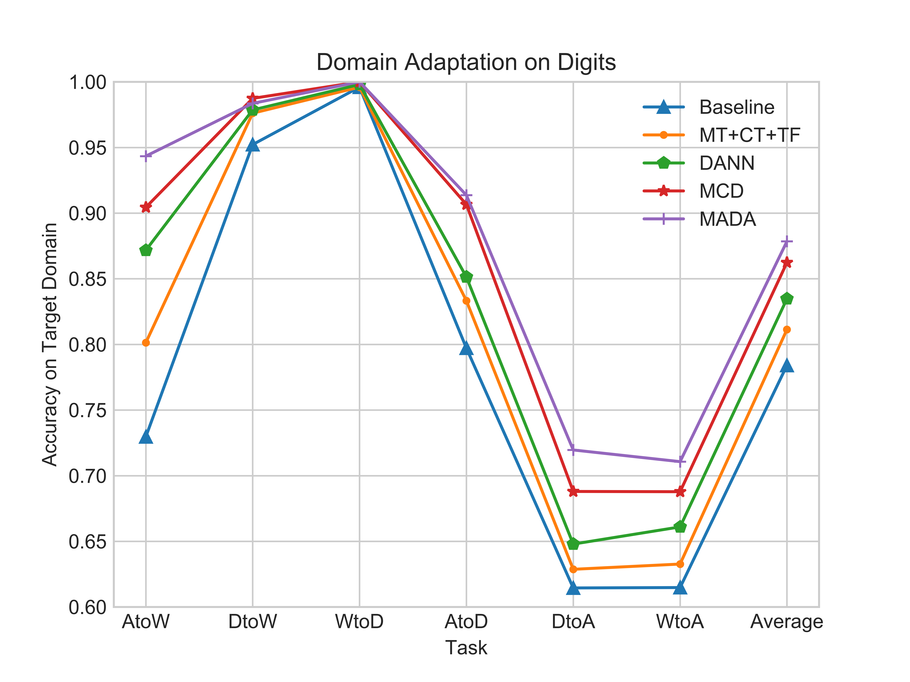
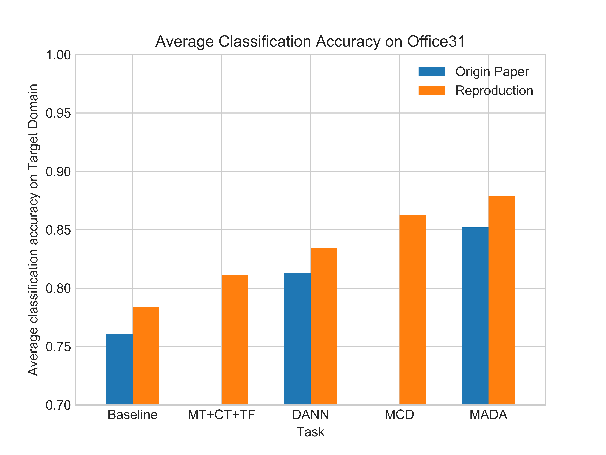

# Reproducing
## Implementation
* Baseline 
    | [ResNet50](http://openaccess.thecvf.com/content_cvpr_2016/html/He_Deep_Residual_Learning_CVPR_2016_paper.html)
    | [Network](https://github.com/ZGCTroy/Domain_Adaptation/tree/master/networks/Baseline.py) 
    | [Solver](https://github.com/ZGCTroy/Domain_Adaptation/tree/master/solvers/BaselineSolver.py)
    |
    
* DANN 
    | [Paper](http://www.jmlr.org/papers/volume17/15-239/15-239.pdf)
    | [Network](https://github.com/ZGCTroy/Domain_Adaptation/tree/master/networks/DANN.py)
    | [Solver](https://github.com/ZGCTroy/Domain_Adaptation/tree/master/solvers/DANNSolver.py)
    |

* MT
    | [Paper](https://arxiv.org/abs/1706.05208)
    | [Network](https://github.com/ZGCTroy/Domain_Adaptation/tree/master/networks/MT.py)
    | [Solver](https://github.com/ZGCTroy/Domain_Adaptation/tree/master/solvers/MTSolver.py)
    |
    

* MCD
    | [Paper](http://openaccess.thecvf.com/content_cvpr_2018/html/Saito_Maximum_Classifier_Discrepancy_CVPR_2018_paper.html)
    | [Network](https://github.com/ZGCTroy/Domain_Adaptation/tree/master/networks/MCD.py)
    | [Solver](https://github.com/ZGCTroy/Domain_Adaptation/tree/master/solvers/MCDSolver.py)
    |
    

* MADA
    | [Paper](https://www.aaai.org/ocs/index.php/AAAI/AAAI18/paper/viewPaper/17067)
    | [Network](https://github.com/ZGCTroy/Domain_Adaptation/tree/master/networks/MADA.py)
    | [Solver](https://github.com/ZGCTroy/Domain_Adaptation/tree/master/solvers/MADASolver.py)
    |
   
## Results

|          | AtoW | DtoW | WtoD | AtoD | DtoA | WtoA | Avg |
|----------|------|------|------|------|------|------|-----|
| Baseline | 0.7296  |0.9522  |0.996  |0.7972  |0.6145  |0.6148  |0.784050|
| MT+CT+TF | 0.8013  |0.9761  |0.996  |0.8333  |0.6287  |0.6327  |0.811350|
| DANN     | 0.8717  |0.9786  |0.998  |0.8514  |0.6479  |0.6610  |0.834767|
| MCD      | 0.9044  |0.9874  |1.000  |0.9066  |0.6880  |0.6878  |0.862367|
| MADA     | 0.9434  |0.9836  |1.000  |0.9137  |0.7196  |0.7107  |0.878500|

|         |UtoM    |MtoU    |StoM       |Avg|
|---------|--------|--------|-----------|---|
Baseline|  0.8072|  0.8475|  0.7989|  0.817867|
MT+CT+TF|  0.9893|  0.9711|  0.9877|  0.982700|
DANN    |  0.9577|  0.8974|  0.9148|  0.923300|
MCD     |  0.9797|  0.9646|  0.9744| 0.972900|
MADA    |  0.9623|  0.9347|  0.9083|  0.935100|

# Getting Started
## Installation

* Install with pip 
        
        $ git clone https://github.com/ZGCTroy/Domain_Adaptation
        
        $ cd Domain_Adaptation
        
        $ pip install -r requirements.txt
    
* Install with docker (recommended)

        $ docker pull zgctroy/DA
    
        $ docker run runtime='nvidia' name='zgctory/DA' -it zgctory/DA
        
        $ cd Domain_Adaptation
        
        $ git pull
  
    
## Download Datasets
* If you install with docker, you do not have to prepare datasets. As datasets have already been included in docker image.
 
* If you install with pip, you have to download datasets by yourself and put them in ./data, and it will look like
    
        - Digits
        -- -- MNIST
        -- -- USPS
        -- -- SVHN
        
        - Office31
        -- -- Amazon
        -- -- Dslr
        -- -- Webcam
        
        - OfficeHome
        -- -- Art
        -- -- Clipart
        -- -- Product
        -- -- Read-World

## RUN
* run Baseline on Digits, from USPS to MNIST

        $ python3.6 main.py --model='Baseline' --dataset='Digits' --source='USPS' --target='MNIST'\
         --cuda='cuda:0' --num_workers=0 --epochs=300 --batch_size=256 --test_interval=1 --optimizer='Adam'
         
* run Baseline on Office31, from Webcam to Dslr
        
        $ python3.6 main.py --model='Baseline' --dataset='Office31' --source='Dslr' --target='Webcam' \
        --cuda='cuda:0' --num_workers=0  --iterations=10004  --test_interval=100 --batch_size=36
        
* If you want to change the task, the model or any other experiment parameters, you can choose them from the following list.

    * model
    
            $ --model=['Baseline', 'MT', 'DANN', 'MCD','MADA']
    
    * Digits Dataset
    
            $ --dataset='Digits'
            $ --source='MNIST' --target='USPS'
            $ --source='USPS' --target='MNIST'
            $ --source='SVHN' --target='MNIST'
    
    * Office31 Dataset
            
            $ --dataset='Office31'
            $ --source=['Amazon','Webcam','Dslr']
            $ --target=['Amazon','Webcam','Dslr']
            
    * OfficeHome Dataset
            
            $ --dataset='OfficeHome'
            $ --source=['Art','Clipart','Product','Real World']
            $ --target=['Art','Clipart','Product','Real World']
           
    * other parameters
    
        The parameters used in this experiment are shown in [experiments](https://github.com/ZGCTroy/Domain_Adaptation/tree/master/experiments) folder,
        
        for Digits Dataset, we recommend 
        
            $ --optimizer='Adam'
            $ --epoch=300
            $ --batch_size=256
            $ --num_workers=[2,3,4,....]
            $ --test_interval=1
            $ --lr=0.001
            
        for Office31 and OfficeHome Datasets, we recommend
        
            $ --optimizer='SGD'
            $ --iterations=10004
            $ --batch_size=36
            $ --num_workers=0
            $ --test_interval=[100,200,300,...]
            $ --lr=0.001
    